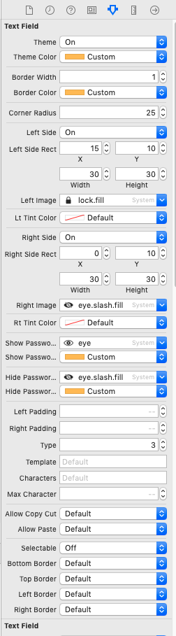

# iOS Custom TextField

A resuable custom TextField component in iOS Swift. It is built upon programmatic UI and fully customizable.

## Table of contents
- [iOS Support](#iOS-support)
- [Demo](#demo)
- [Features](#features)
- [Getting started](#getting-started)
- [Usage](#usage)
- [Methods](#methods)
- [Want to Contribute?](#want-to-contribute)
- [Need Help / Support?](#need-help)
- [Collection of Components](#collection-of-Components)
- [Changelog](#changelog)
- [License](#license)
- [Keywords](#Keywords)

------

## iOS Support

Versions iOS 12, iOS 13

We have tested our program in above versions, however you can use it in other versions as well.

------

## Demo

------

## Features

- Customisable UITextField with more properties.
- Common class can be used for different textfields based on Type. For e.g. Email TextField, Password TextField, Phone TextField

------

## Getting started

Download this sample project and import WLITextField file in your project.

------

## Usage

Setup process is described below to integrate in project.

* Go to identity inspector and set WLITextField as your textfield class.
* Set your property using Attrubutes inspector in UITextField 

* Create IBOutlet of textFieldView and set below propetise base on your requirements

For example    
    
    //set delegate
    txtUserName.wliDelegate = self
    
    //set keyboard type
    txtUserName.keyboardType  = .default

    //set border 
    txtUserName.typeBorder = .BottomBorder
    
    //return key to disable keybord or not
    txtUserName.returnKeyPressToHideKeybord = true
    
    //allow paste or not
    txtUserName.allowPaste = true
    
    //allow to copy or cut from textField
    txtUserName.allowCopyCut = true
    
    //set max Character of textField
    txtUserName.maxCharacter = 10
    
    //set Allow character to put in textField 
    txtUserName.allowCharacterOnly = "+0123456789"

------

## Methods

Set delegate methods to get call back in your project controller where WLITextfield class is assigned.

    func WLITextFieldShouldBeginEditing(_ textField: UITextField) -> Bool
    func WLITextFieldDidBeginEditing(_ textField: UITextField)
    func WLITextFieldShouldEndEditing(_ textField: UITextField) -> Bool
    func WLITextFieldDidEndEditing(_ textField: UITextField)
    func WLITextFieldDidEndEditing(_ textField: UITextField, reason: UITextField.DidEndEditingReason)
    func WLITextField(_ textField: UITextField, shouldChangeCharactersIn range: NSRange, replacementString string: String, maxCharacters result: Bool) -> Bool
    func WLITextFieldShouldClear(_ textField: UITextField) -> Bool
    func WLITextFieldShouldReturn(_ textField: UITextField) -> Bool
    
------

## Want to Contribute?

- Created something awesome, made this code better, added some functionality, or whatever (this is the hardest part).
- [Fork it](http://help.github.com/forking/).
- Create new branch to contribute your changes.
- Commit all your changes to your branch.
- Submit a [pull request](http://help.github.com/pull-requests/).

------

## Need Help? 
We also provide a free, basic support for all users who want to use this Custom Reusable TextField demo in project. In case you want to customize this Custom TextField to suit your development needs, then feel free to contact our [iOS
developers](https://www.weblineindia.com/hire-ios-app-developers.html).

 ------
 
## Collection of Components
 We have built many other components and free resources for software development in various programming languages. Kindly click here to view our [Free Resources for Software Development.](https://www.weblineindia.com/communities.html)
 
------

## Changelog
Detailed changes for each release are documented in [CHANGELOG](./CHANGELOG).

## License

 [MIT](LICENSE)

 [mit]: https://github.com/weblineindia/iOS-Custom-TextField/blob/master/LICENSE

## Keywords

WLITextField, Reusable Textfield, Customisable Textfield,  Customisable Textfield Swift, Custom Swift Textfield, iOS Swift Textfield, weblineindia
